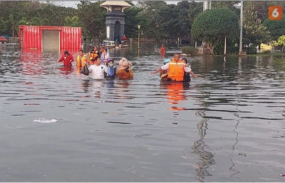
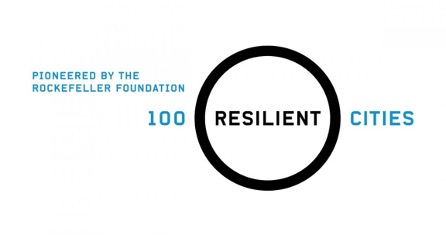
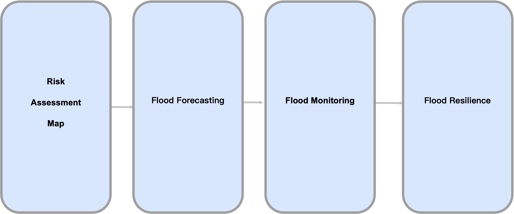
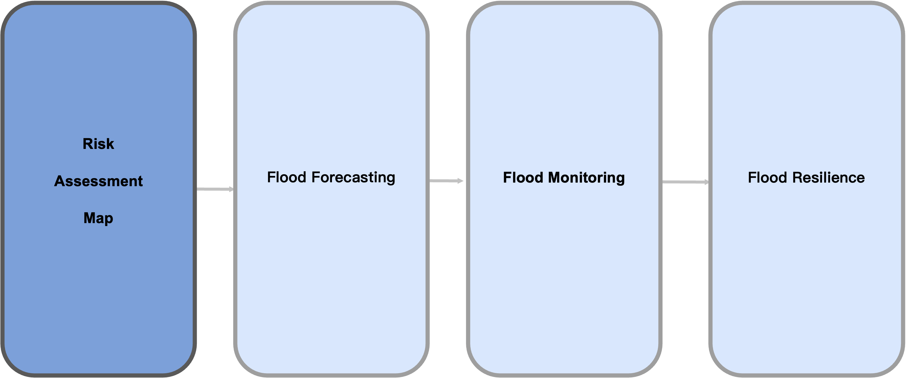

```{r setup, include=FALSE,echo=FALSE}
options(htmltools.dir.version = FALSE)
library(dplyr)
library(readr)
library(readxl)
library(knitr)
```

```{r xaringan-themer, include=FALSE, warning=FALSE}
library(xaringanthemer)
style_duo_accent(primary_color = "#0D5E74", secondary_color = "#2881C6",
  header_font_google = google_font("Josefin Sans"),
  text_font_google   = google_font("Montserrat", "300", "300i"),
  code_font_google   = google_font("Fira Mono"),
)
```

```{r xaringan-all, echo=FALSE, warning=FALSE}
library(countdown)
library(xaringan)
library(xaringanExtra)
hook_source <- knitr::knit_hooks$get('source')
knitr::knit_hooks$set(source = function(x, options) {
  x <- stringr::str_replace(x, "^[[:blank:]]?([^*].+?)[[:blank:]]*#<<[[:blank:]]*$", "*\\1")
  hook_source(x, options)
})
xaringanExtra::use_broadcast()
xaringanExtra::use_freezeframe()
xaringanExtra::use_scribble()
#xaringanExtra::use_slide_tone()
xaringanExtra::use_search(show_icon = TRUE, auto_search	=FALSE)
xaringanExtra::use_freezeframe()
xaringanExtra::use_clipboard()
xaringanExtra::use_tile_view()
xaringanExtra::use_panelset()
xaringanExtra::use_editable(expires = 1)
xaringanExtra::use_fit_screen()
xaringanExtra::use_extra_styles(
  hover_code_line = TRUE,         
  mute_unhighlighted_code = TRUE  
)
```

```{r setupbibliography, include=FALSE}
# Code supplied by Andy (see wk2 slides 25-28)
library(RefManageR)
library(knitcitations)
BibOptions(check.entries = FALSE,
           bib.style = "authoryear",
           cite.style = "authoryear",
           style = "markdown",
           hyperlink = TRUE,
           dashed = FALSE,
           no.print.fields=c("doi", "url", "urldate", "issn"))
myBib <- ReadBib("references.bib",
                 # "./Bib.bib", 
                 check = FALSE)
```

class: center, title-slide, middle

background-image: url("img/semarang_cover.jpeg")
background-size: cover
background-position: center

# Semarang Tidal Floods & Informal Settlements
## CASA0023<br/>Group Project
### Hilman et al.

### `r format(Sys.time(), "%d/%m/%Y")`

---
class: inverse, center, middle

# Problem: Context & Background

---
class: center, middle


.pull-left[
```{r echo=FALSE, out.width='120%', fig.align='left'}

```
]
.pull-right[
```{r echo=FALSE, out.width='120%', fig.align='left'}

```
]

Image credit: [Merah Putih](https://merahputih.com/post/read/banjir-rob-genangi-sejumlah-wilayah-pesisir-di-semarang), [Merdekah](https://www.merdeka.com/jateng/5-fakta-banjir-rob-semarang-ketinggian-air-capai-15-meter.html)


---
# Location


- Capital city of Central Java, Indonesia

- North of Semarang is located next to Java Sea which become the main port and access of food supply  for Central Java.

- **Put more from the impact paper**

```{r echo=FALSE, out.width='50%', fig.align='center'}
knitr::include_graphics("img/s4_map.png")
```

Source: [Dameria et al. 2022](https://www.researchgate.net/publication/357859602_The_relationship_between_residents'_sense_of_place_and_sustainable_heritage_behaviour_in_Semarang_Old_Town_Indonesia)

---
# Problem Statement

- 20 villages on 7 districts on coastal areas are suffering from tidal flood every year because the increase of sea level, coastal abrasion, and land subsidence (citation: Ketangguhan Kota - Semarang dalam Menghadapi Bencana Banjir Pasang Air Laut (Rob))

- Semarang sinks up to 15cm/year due to  the increase of population density and  declination of groundwater

.pull-left[
```{r echo=FALSE, out.width='70%', fig.align='left'}

```
]

.pull-right[
```{r echo=FALSE, out.width='70%', fig.align='left'}

```
]

Image credit: [Wikimedia Commons](https://commons.wikimedia.org/wiki/File:Sharingan_triple.svg)

---
#Impact
.panelset[
.panel[.panel-name[Social]

- Around 1660 Ha area flooded with 72,903 people living within those area 
- Water supply and electricity cannot be utilized 
- Disruption of household activity 
- High exposure to illness, such as, diarrhea, fever, and malaria 
- Disruption of transportation access
- Causing isolated residential area
- Damage of production area (ie fishpond and rice field)
]

.panel[.panel-name[Economic]
- Loss IDR 144 Billion/year (£7,714,513/year) because of the environmental damage, such as: (citation: KAJIAN PEMANFAATAN DEM SRTM & GOOGLE EARTH UNTUK PARAMETER PENILAIAN POTENSI KERUGIAN EKONOMI AKIBAT BANJIR ROB)
  - Production land damage (fishpond, and rice field)
  - Housing damage
  - Infrastructure damage
- Spend IDR 14,209,324,000/year (£761,236/year) to handle waste  (citation: introduction study of tidal flood waste management cost)
]

.panel[.panel-name[Environmental]
Around  70 tons of waste generated (per year?)

```{r, echo=FALSE, message= FALSE}
library(readxl)
x <- read_excel('img/asset.xlsx')
library(tidyverse) #where the mpg data is stored
```

```{r, echo=FALSE}
knitr::kable(head(x), format = 'html')
```
]
]

Source: [Rahma et al. (2019) ](https://www.e3s-conferences.org/articles/e3sconf/pdf/2019/51/e3sconf_icenis2019_07020.pdf)

---
# UN Sustainable Development Goals


.pull-left[

```{r echo=FALSE, out.width='50%', fig.align='center'}

```

**Raise Housing standards, inclusive urbanisation, disaster planning and mitigation**

% urban population in informal settlements

% of cities with civil society planning input

Disaster-related economic, infrastructure and life loss

]

.pull-right[

```{r echo=FALSE, out.width='50%', fig.align='center'}

```

**Build resilience, climate change planning in LDCs **

Sendai Framework implementation

% local government in line with national risk disaster reduction strategies

Contributions, strategies, plans and communications reported to UNFCCC

]
---

# Current Semarang Resilience Strategy
### 3rd Pillar Strategy: Preparedness for Disaster and Disease Outbreak


**A Developing Technology for Disaster Management**

Raise Public Awareness on Disaster-Prone Areas
Explore Alternative Methods to Prevent Dengue Fever
Explore New Technology in Disaster Management

**B Enhancing Capacity of Stakeholders in Disaster and Disease Management**

Replicate Disaster Preparedness Groups in Disaster Prone Areas
Improve A Community- Based Sanitation System
Increase capacity of stakeholder in facing Disaster and Diseases Outbreaks

**C Improve Coordination in Disaster Risk Reduction**
Prepare Participatory Contingency Plan

```{r echo=FALSE, out.width='30%', fig.align='center'}

```
---
class: inverse, center, middle

##Unclear what information is used to guide responses.

---
#Compliance to Sendai Framework for Disaster Risk Reduction 

**Priority 1: Understanding disaster risk**

Policies and practices for disaster risk management should be based on vulnerability, capacity, exposure of persons and assets, hazard characteristics and the environment

- Knowledge can be used for **pre-disaster risk assessment**, prevention, mitigation and for the development and implementation effective response to disasters.

- To develop, periodically update and disseminate location-based disaster risk information including **risk maps** to decision makers, the public and at-risk communities in an appropriate format by using **geospatial information technology**; and

- To promote real time access to data, make use of space and in situ information including **GIS** and use IT innovations to enhance measurement tools and the **collection, analysis and dissemination of data**.
---
#Case Study

### Dar es Salaam, Tanzania
Widespread flooding and informal settlement
50,000 affected, + $780,000 in recovery and emergency response.
.pull-left[
Community risk mapping project led by the World Bank and other Tanzanian NGOs 
* Identified substantial geospatial information including landuse, infrastructure and exposure data
* 3.5 million residents in over 228 communities mapped within 3 years.

Information drove city-wide, multistakeholder initiative to generate regional level response and planning for disaster [Global Assessment Report, 2019](https://gar.undrr.org/chapters/chapter-9-review-efforts-made-member-states-implement-sendai-framework.html#Specialcasestudy).
]

.pull-right[
```{r echo=FALSE, out.width='90%', fig.align='right'}

```
]
Image credit: [Ubuntu Times](https://www.ubuntutimes.com/poor-infrastructures-rapid-urban-sprawl-increase-flood-risk-in-tanzanias-largest-city/)
---
#Approach

```{r echo=FALSE, out.width='140%', fig.align='center'}

```
---
#Approach

```{r echo=FALSE, out.width='140%', fig.align='center'}

```

---
# Methodology

???

All text under the three question marks are presentation notes; it is hidden from the presentation slides and only available in presenter mode.

---

# Methodology

```{r method_img, echo=FALSE, out.width='130%', fig.align='center'}
knitr::include_graphics('img/methodology-flowchart.png')
```

---

class: inverse, center, middle

```{r riskmap_img, echo=FALSE, out.width='70%', fig.align='center'}
knitr::include_graphics('img/risk-map-example.png')
```


---

# Methodology

'Ensemble-based' Machine Learning approach

--

1. Using database of historic flood data, split into training (70%) and testing (30%) set  

1. Build a map (raster) of each hazard input parameter  

1. Estimate flood probability indices (Frequency Ratio Approach)  

1. Apply a Support Vector Machine (SVM) model, which will classify the input pixels   

1. Build a map (raster) of each vulnerability input parameter, classified on a quantile scale

1. Combine the hazard and vulnerability maps together to produce single risk index

1. Validate the model using testing set of data

???
Presenter Notes

Refs for this section: Taubenböck et al 2011; Mojadaddi et al. 2017; Tehrany et al. 2014; Flood database: Tellman et al. 2021

Methodology: ‘Ensemble-based’ machine learning using SVM (Support Vector Machine)
Each parameter rendered/built as a raster layer
Frequency Ratio (FR) approach can be used to estimate flood probability indices, using the hazard parameters (the inputs are each classified using quantile breaks and an FR value assigned to each class). This will output which classes of which parameters (e.g. which values of elevation) are at the highest probability of flood. 
Apply an SVM model; essentially a statistical theory to minimise operational risk standard, and performs a binary classification on the input pixels. 
Repeat the process for vulnerability parameters, by classifying the raster cells on a scale (e.g. 0 to 5) of vulnerability depending on the parameter value. 
The Hazard and Vulnerability models can then be multiplied together, and a weighted overlay applied.
A training set taken from historic flood events can be used to validate the built model. 


---

class: middle, center

# EO Data: Hazard

```{r hazardtbl, echo=FALSE, message=FALSE}
hazardtbl <- readxl::read_excel("img/eo-source-tables.xlsx", sheet = 1)
knitr::kable(hazardtbl, format = 'html', col.names = c("Purpose", "EO data", "Spatial resolution", "Temporal resolution", "Cost", "Processing"))
```

???

Data pre-processing except Correction and resampling ?  What is our smallest research scale?

Tidal range is the term describing the vertical change between the maximum high tide and the minimum low tide and is related to tidal flooding.(Tidal range is the difference in height between high tide and low tide.)
Indonesia Agency for Meteorology, Climatology, and Geophysics (BMKG)
NOAA Jason-3  is capable of measuring significant wave height (radar altimeter), sigma naught (sigma0), dry and wet troposphere and ionosphere, which can be used to calculate sea surface height, sea surface height anomalies, and total electron content.
A high rate of Sea Level Rise was designated to correspond to high coastal vulnerability and vice versa. 
Significant Wave Height is a replacement of wave energy, it is the average of the highest one-third (33%) of waves (measured from trough to crest) that occur in a given period. Satellite altimetry was the primary data for extracting the significant wave high.

---

class: middle, center

# EO Data: Hazard (cont.)

```{r hazardtbl2, echo=FALSE, message=FALSE}
hazardtbl2 <- readxl::read_excel("img/eo-source-tables.xlsx", sheet = 2)
knitr::kable(hazardtbl2, format = 'html', col.names = c("Purpose", "EO data", "Spatial resolution", "Temporal resolution", "Cost", "Processing"))
```

???

Reference Luca Brocca et al 2019
The SM2RAIN–ASCAT data record is obtained from the application of the SM2RAIN algorithm to the ASCAT soil moisture data records H113 and H114 provided by the European Organisation for the Exploitation of Meteorological Satellites (EUMETSAT) https://essd.copernicus.org/articles/11/1583/2019/essd-11-1583-2019.html
The Soil Moisture (SM) product provides an estimate of the water content of the 0-5 cm topsoil layer, expressed in degree of saturation between 0 and 100 [%]. SM processor.
Land Subsidence and InSAR reference https://www.sciencedirect.com/science/article/pii/S0273117718300711


---

# EO Data: Vulnerability

```{r vulntbl, echo=FALSE, message=FALSE}
vulntbl <- readxl::read_excel("img/eo-source-tables.xlsx", sheet = 3)
knitr::kable(vulntbl, format = 'html', col.names = c("Purpose", "EO data", "Spatial resolution", "Temporal resolution", "Cost", "Processing"))
```

???

Reference V. H. R. Prudente et al 2020
Normalized Difference Built-up Index, NDBI = (SWIR - NIR) / (SWIR + NIR), NDBI = (Band 6 - Band 5) / (Band 6 + Band 5)  in Landsat 8
Normalized Difference Water Index, NDWI = (Green - NIR) / (Green + NIR), NDWI = (Band 3 – Band 5)/(Band 3 + Band 5)
SAR satellite data can be helpful in LULC mapping in a tropical region with high cloud cover. https://ieeexplore.ieee.org/document/9323404
Unmanned Aerial Vehicle Remote Sensing

---

## Additional data

```{r othertbl, echo=FALSE, message=FALSE}
othertbl <- readxl::read_excel("img/eo-source-tables.xlsx", sheet = 4)
knitr::kable(othertbl, format = 'html', col.names = c("Purpose", "Data", "Scale", "Cost"))
```

---

# Recommended Action Plan

```{r output_img, echo=FALSE, out.width='130%', fig.align='center'}

```

???

Climate is changing + informal settlement locations and densities may change rapidly. Maps and plan should be updated annually or every few years 
Data should be available to all relevant stakeholders, so diff departments
aren’t separately collecting data and planning with diff information

Semarang resilience strategy has all these actions that they want to implement in locations that are prone to tidal floods, so with this map they can have a more updated idea of these target areas. One of their key goals is to increase coordination between stakeholders during disasters.

Be specific link it without risk map.

Use this data to make updates to Semarang’s disaster plan:
Develop flood resistant infrastructure, such as roads, in high risk areas.
Update evacuation plan.
Improve drainage systems in high risk areas.
If implementing an early detection warning system, prioritise placement of sensors in high risk areas.
Create a task force to update risk assessment maps annually based on up-to-date data. Update disaster plan accordingly.
Dashboard with risk and vulnerability map with population data; make this available across all relevant sectors - emergency response, health care, city operations.

---

# Resource Allocation

```{r actiontbl_img, echo=FALSE, out.width='130%', fig.align='center'}
knitr::include_graphics('img/action-table.png')
```

---

class: inverse, center, middle

# Plan

---

# Project Timeline

```{r gantt_img, echo=FALSE, out.width='130%', fig.align='center'}
knitr::include_graphics('img/gantt-chart.png')
```

---

# Budget Breakdown

```{r budget_img, echo=FALSE, out.width='130%', fig.align='center'}

```


---

# Risks and Limitations

.pull-left[
**Risk**

- Unexpected employee turnover

- Unexpectedly high costs

- Political disruption

- Disaster during assessment
]

.pull-right[
**Mitigation**

- Consistent data management for smooth transition

- Allow for budget headroom

- Active political monitoring and civil society engagement
]

---

# Summary
## Benefits to the City

How much will Semarang save?

